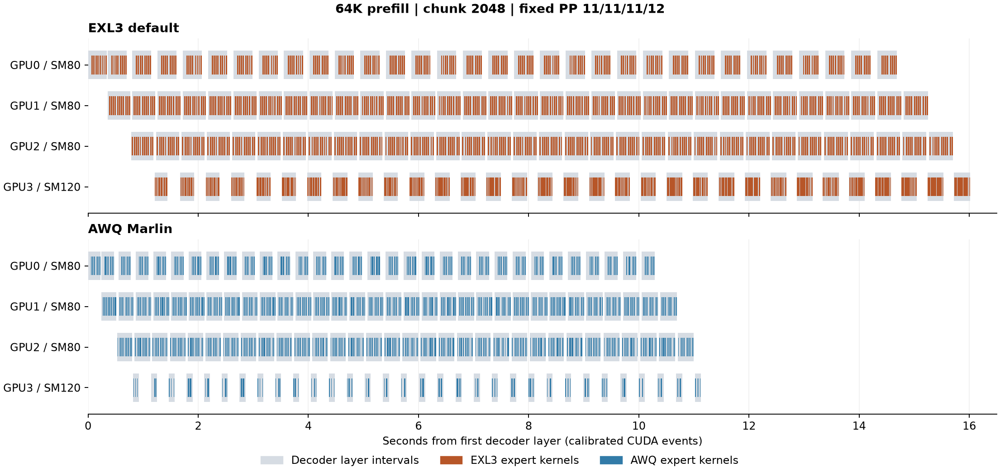

# EXL3 64K prefill 目标与实验记录（2026-09-11）

**4700 token/s 目标已达到：固定 `11/11/11/12` 分层，展开 INT8 + grouped IMMA + chunk 6144 + 普通投影缓存的独立 64K 复测中位数为 4738.0 token/s，TTFT 13.832 秒。五次采样均超过 4700；同轮默认基线为 4086.4 token/s、16.038 秒，提升 15.95%。**

4700 可以作为这台混合 GPU 机器的工程目标，但原估算的两个参数不应视为已验证事实。它对应 65536-token TTFT 13.944 秒。首轮生产默认控制为 4093.8 token/s，达到目标需要提高 14.8%；相对旧的 3634 则是 29.3%。当前结论依据整模型复测，而非微基准外推。

新路径保持可选：8K/16K 吞吐回退、额外显存明显，且会引入数值误差。64 题 GSM8K 对照未发现新错误，但不足以证明量化无损或整体精度提高。生产默认 M32、chunk 2048、普通 INT8 GEMV 2 和混合专家 decode 保持不变。

## 平台与口径

- GLM-5.3-Flash EXL3 4.05bpw；GPU0–2 为 CMP 170HX / SM80，GPU3 为 RTX PRO 6000 Blackwell / SM120。TP1、PP4，实际层索引始终核验为 0–10、11–21、22–32、33–44，即 `11/11/11/12`。
- 所有请求基准使用同一份 token IDs，B1，固定生成 32 token，零 prefix-cache 命中，每 rank KV 8 GiB，max length 66560。长度扫描每个输入长度 1 次预热、3 次采样；首轮默认 chunk 2048 合并前测 3 次和后测 2 次。最终独立 64K 对照为默认 3 次、候选 5 次；命令中的 `--batch-size 4` 是引擎容量，实际请求仍为 B1。
- 输入吞吐为 `prompt_tokens / TTFT`，表格取样本中位数。它包含调度和首 token 开销。普通 INT8 GEMV 使用生产默认 2，专家 decode 使用 SM80 plain / SM120 residual；专家微基准另显式设置普通 GEMV 为 0。
- 显式扩大 scheduler chunk 时，同时扩大 EXL3 expert workspace；GPU0–2 采用被测内核，GPU3 保留原专家路径。跨 chunk 表格是配置调优，不能解释成相同调度配置下的纯格式差距。

## 对目标假设的实测核对

CMP 上 CUPTI 返回 `CUPTI_ERROR_CMP_DEVICE_NOT_SUPPORTED (42)`。CPU-only Torch trace 没有被当作 GPU 证据。改用 CUDA event，按公共 host monotonic 时钟对齐各 rank 的层/专家区间，每个 rank 从 8 次校准中取最短包围区间；半宽约 6–8 微秒。这个区间不覆盖所有时钟漂移。

从实际 chunk/stage 结束关系回溯 flow-shop 路径，得到以下估计。吞吐来自独立的不带 event 的测量，路径占比来自带 event 的诊断请求，二者不能混作同一次采样。

| 格式 / chunk | 64K 输入 token/s | 近似关键路径中的 SM80 专家占比 |
| --- | ---: | ---: |
| timeline-awq-1024 | 5722.7 | 45.47% |
| timeline-awq-2048 | 5916.4 | 43.55% |
| timeline-exl3-2048 | 4125.1 | 55.41% |

图中两组均为 chunk 2048；灰色为层区间，彩色为被采集的专家算子区间，时间原点是首个 decoder 层开始。AWQ 最后一个未量化 MoE 层没有 Marlin 标签，其总耗时仍包含在灰色层区间。该图用于默认基线的瓶颈分析，不是新 INT8 配置的计时图。

AWQ 的 SM80 专家占比约 44%–45%，与原假设的 50% 接近但不相同。EXL3 当前约 55%。该路径模型只描述观测到的调度，优化后等待区间可能变化；不能把路径比例作为因果硬件计数器结论。各 rank 的专家时间不可直接相加成请求延迟，嵌套层/专家区间也不可相加。

“其余部分接近 AWQ”仍缺乏支持。例如 rank1 的全部层区间减专家区间，EXL3 约 5.30 秒，AWQ/chunk2048 约 4.68 秒；GPU3 的专家区间差异也很大。原范围 4400–5100 仅是参数敏感性分析，不是置信区间。当前实测 AWQ/chunk2048 为 5916.4，4700 相当于约 79.4%；原先约 83% 的比例只适用于旧 5597 基线。

## Chunk 消融

保持生产默认内核，只有调度 chunk/专家容量变化，单位输入 token/s。

| Chunk | 8K | 16K | 32K | 64K |
| --- | ---: | ---: | ---: | ---: |
| 2048，前后控制合并 | 2836.5 | 3448.5 | 3847.3 | 4093.8 |
| 3072 | 2618.7 | 3310.5 | 3860.5 | 4180.5 |
| 4096 | 2248.6 | 3044.9 | 3691.0 | 4127.2 |
| 8192 | 1543.9 | 2320.9 | 3143.3 | 3803.1 |

扩大 chunk 本身不能达到目标，且短输入损失明显。56/56 检索访问码检查通过，但这不是完整长上下文质量评估。

## 内核与缓存实验

真实路由取 layer3/22 各连续 4 个 2048-token chunk，拼接成 8192 行，没有重复样本来伪造大 M。拼接后的路由不保证与实际 8192 scheduler chunk 完全一致，最终以整模型测试为准。完整 wrapper 的 CUDA Graph 计时包含路由、变换、激活、三个投影及归约，每次采样前在计时区间外驱逐 256 MiB L2。

| 方向 | 观测结果 |
| --- | --- |
| M32/K16 双 block 驻留 | 将 shared carveout 从 0 改为 25 后，CUDA occupancy 实际从 1 变为 2；真实路由完整专家快约 3%–4%。 |
| Warp 展宽、固定 4096/2048 维度 | 未显示收益；部分编译版本有明显局部内存 spill。 |
| N128 共享解码的 M32/M64 | 去除 spill 仍慢约 10%–25%，说明 spill 不是唯一成本。 |
| M64/N256/K128 共享解码 | 4096 行快约 6%，8192 行快约 10%；1024 行更慢。 |
| 同 kernel 自适应 M32/M64 | 合并路径后编译器生成大量 spill，未获得稳定收益。 |
| 普通投影 FP16 缓存 | 每 SM80 预算 4 GiB，实际约 3.1–3.9 GiB；1024 行以下回退普通量化路径。小幅整模型收益，以额外显存为代价。 |
| 整个专家投影临时展开 FP16 | 每次仅展开 gate/up/down 中一个，288×4096×2048 权重占 4.5 GiB，另需激活缓冲。8192 行完整专家约 80 ms 降至 60 ms；2048 行更慢。 |

FP16 展开路径两个真实路由层共 36 条完整 wrapper 记录，最大相对 L2 约 0.000886。代码及使用方法见 [prefill 实验](../../benchmarks/kernels/exl3_prefill/README.md)、[临时 FP16 路径](../../benchmarks/kernels/exl3_prefill_fp16/README.md)。

## 展开 INT8 的阶段成本

INT8 原型通过了 8 项独立正确性测试，包括 hidden=768 的非二次幂维度和改变输入/路由后的图重放。两层真实路由的最大相对 L2 分别为 0.628% 和 1.134%，低于事先约定的 2% 上限；这些误差不能称为无损。

Layer22、8192 行完整 wrapper 的独立 clean 计时为 FP16 59.07 ms、INT8 50.43 ms。图内 external CUDA event 诊断分别为 59.27/50.50 ms，以下是不重叠的阶段中位数。

| 阶段 | FP16 ms | INT8 ms |
| --- | ---: | ---: |
| 三次权重重建 | 19.65 | 18.83 |
| 三次 grouped GEMM | 33.31 | 24.43 |
| 激活量化 | 0 | 1.29 |
| 输入 gather/Hadamard | 2.75 | 2.58 |
| 激活/输出变换及 scatter | 2.98 | 2.77 |

收益主要出现在 GEMM；展开 INT8 权重的重建耗时仍占约 37%，没有随输出字节减半。这是后续瓶颈的直接证据，具体指令/带宽归因仍需消融。PTX 中确认 IMMA，当前 M64/N128/K64 GEMM 为 162 registers、0 spills、24 KiB shared。在本节 **8192 行** 配置中，INT8 总临时缓冲约 3.50 GiB，FP16 约 5.50 GiB，均不含旧 EXL3 workspace、KV 和普通投影缓存。最终 6144 配置的内存见下文。

## 已完成整模型对照

单位输入 token/s。下表每个单元格均为 3 次中位数；末尾控制用于检查漂移。

| 配置 | 8K | 16K | 32K | 64K |
| --- | ---: | ---: | ---: | ---: |
| M32/K16，chunk 2048 | 2909.2 | 3508.4 | 3906.2 | 4093.9 |
| M32/K16 + 投影缓存，chunk 2048 | 2961.9 | 3582.6 | 3978.8 | 4164.5 |
| M32/K16 + 投影缓存，chunk 3072 | 2703.4 | 3393.0 | 3929.6 | 4160.9 |
| M64 共享解码 + 投影缓存，chunk 4096 | 2363.0 | 3201.6 | 3885.7 | 4348.0 |
| 原生末尾控制，chunk 2048 | 2835.8 | 3445.2 | 3848.7 | 4088.6 |
| model-fp16-8192 | 1755.4 | 2650.9 | 3614.7 | 4405.4 |
| model-fp16-cache-8192 | 1764.1 | 2664.2 | 3631.5 | 4419.4 |
| model-fp16-cache-6144 | 2087.8 | 3023.7 | 3828.2 | 4482.7 |
| model-fp16-cache-4096 | 2309.2 | 3125.0 | 3794.4 | 4242.4 |
| model-batched-int8-cache-6144 | 2199.1 | 3183.8 | 4060.2 | 4783.3 |
| model-batched-int8-cache-8192 | 1865.4 | 2826.4 | 3861.4 | 4700.1 |
| model-batched-int8-cache-4096 | 2444.4 | 3312.3 | 4034.9 | 4511.0 |

所有已列模型组的访问码检查均通过，其中三组展开 INT8 长度扫描共 36/36。32-token 上限只足以验证指定访问码，不能声称完整输出质量不变。

## 最终独立 64K 复测

从初轮三组 INT8 候选中选择 chunk 6144 后，重新启动两套引擎做独立确认；使用相同的 65536 token IDs、固定分层和 KV 预算。候选 event profile 在五次 clean 性能采样完成后单独执行，不计入这些结果。

| 配置 | 各次输入 token/s，按执行顺序 | 中位数 token/s | 中位数 TTFT 秒 |
| --- | --- | ---: | ---: |
| 默认，chunk 2048 | 4107.5、4086.4、4064.7 | 4086.4 | 16.038 |
| 展开 INT8 + 缓存，chunk 6144 | 4775.6、4757.2、4738.0、4725.1、4721.8 | **4738.0** | **13.832** |

采样中存在向下漂移，因此采用最终独立中位数，不把初轮 4783.3 当作最终成绩。五次均超过目标，但最低样本只高出约 21.8 token/s；这不是所有负载、温度和机器的性能保证。相对同轮默认提升 15.95%，相当于本轮 AWQ/chunk2048 5916.4 的约 80.1%；不是旧估算中的 83%。整机含 SM120，不能用这个绝对值代表纯 SM80 机器。

运行后状态确认 GPU0–2 使用 `m64n128k64`、阈值 4096，实际调用数为 624/858/858，fallback 为 0；两个投影形状均记录 IMMA 指令。GPU3 没有安装此 INT8 backend。默认普通 INT8 GEMV 和混合专家 decode 继续生效。

## 模型输出与数值检查

质量对照使用相同 64 道 GSM8K、B1、最多生成 768 token。候选把分派阈值临时降为 9 行，确保短题实际经过新算术；GPU0–2 调用数为 520/715/715，fallback 为 0。性能配置阈值仍是 4096，二者不可混淆。

| 配置 | 答案正确 | 达到输出上限的题数 | 错题 ID |
| --- | ---: | ---: | --- |
| 同轮默认 | 62/64 | 0 | 9、12 |
| 展开 INT8 | 64/64 | 0 | 无 |

两组最终答案一致 62/64，完整 token 序列一致 18/64，没有默认答对而新路径答错的题。默认的两道错题是答案错误，非截断或解析失败。历史默认 64/64 没有在这次复现，应使用同轮 62/64 作对照。

这是有限样本的未发现退化结果，不能据此宣称整体质量提高或量化无损。真实路由最大相对 L2 为 1.134%，且输出序列发生变化。长输入访问码检查也不能替代更全面的长上下文质量评测。

## 参数建议与显存成本

保留生产默认 **SM80 M32、chunk/workspace 2048、priority 1、普通 INT8 GEMV 2、专家 decode SM80 plain / SM120 residual**。对以 64K B1 为主且有显存余量的任务，可显式启用新 worker、`m64n128k64`、阈值 4096、chunk/workspace 6144、每 SM80 4 GiB 普通投影缓存预算；[完整命令](../../benchmarks/kernels/exl3_prefill_int8/README.md)。

同一轮长度扫描中，相对末尾默认控制，选中的 6144 配置在 8K 回退约 22.5%、16K 回退约 7.6%，32K 提升约 5.5%。全局增大 chunk 会改变 pipeline 重叠和填充效率，小输入仍会受影响，不能只凭 64K 成绩修改通用默认值。

最终 6144 运行后记录的每 rank 分配如下，单位 GiB：

| Rank | 新 INT8 临时缓冲，含激活量化 | 普通投影缓存实际占用 | 原有专家 workspace | 相对默认新增以上缓冲 |
| --- | ---: | ---: | ---: | ---: |
| GPU0 / SM80 | 3.188 | 3.867 | 1.125 | 7.805 |
| GPU1、GPU2 / SM80，各自 | 3.188 | 3.113 | 1.125 | 7.051 |
| GPU3 / SM120 | 0 | 0 | 3.234 | 2.156 |

INT8 临时缓冲由 3 GiB workspace 和 201719808 字节激活量化 scratch 组成。原有 SM80 workspace 从 0.375 GiB 增至 1.125 GiB，SM120 从 1.078 GiB 增至 3.234 GiB。表格只核算这些缓冲，不是整进程峰值显存；量化权重和每 rank 8 GiB KV 仍常驻。

## 验证与复现证据

- [归档清单及 SHA256](exl3-target4700-20260911/manifest.json)：原始请求、微基准、构建资源、测试输出、源文件快照及运行命令。
- [最终结果核验](exl3-target4700-20260911/final-analysis.json.gz)、[独立默认复测](exl3-target4700-20260911/confirmation-default.json.gz)、[独立 INT8 复测](exl3-target4700-20260911/confirmation-batched-int8.json.gz)。
- [默认质量检查](exl3-target4700-20260911/quality-default.json.gz)、[INT8 质量检查](exl3-target4700-20260911/quality-batched-int8.json.gz)。
- [时间线分析](exl3-target4700-20260911/timeline-analysis.json.gz)、[原始 EXL3 event 记录](exl3-target4700-20260911/timeline-exl3-2048.json.gz)、[AWQ/chunk2048 event 记录](exl3-target4700-20260911/timeline-awq-2048.json.gz)。
- 先前 CUDA 正确性套件按构建批次为 44/32/20/24/20 项通过；FP16/普通投影缓存共 13 项通过。这些对应已有实验构建，不能代替新 INT8 的验证。
- 新展开 INT8 正确性测试 **8 项通过**：`VLLM_EXL3_TEST_BATCHED_INT8_LIBRARY=... EXL3_INT8_GEMV=0 CUDA_VISIBLE_DEVICES=0 .venv/bin/python -m pytest tests/quantization/test_exl3.py -k experimental_batched_int8_prefill -q`。包含改变输入/路由后的图重放；两层真实路由另有 36 条完整 wrapper 记录。
- 本次新增代码的提交前 hooks 和 Python 3.12 mypy hook 通过；类型检查覆盖范围遵循仓库排除规则。公开基准另通过 5 项 CPU 控制流程检查，覆盖独立 B1 批次、默认批次、原版后端运行状态保护及无效批次参数；这不冒充 GPU 测试。实测计算源文件的校验值保持一致，见归档 `final-source-check.json.gz`。
- 整模型测量使用归档的 `benchmark_model.py.gz`。公开 `benchmarks/benchmark_exl3.py` 已补入独立 `--eval-batch-size` 和有保护的运行后状态采集；复现时显式传入记录中的参数。归档保留实际测量脚本哈希，不将新公开脚本冒充当时的逐字节版本。

当前目标已经有整模型证据支持。后续如继续优化，最直接的线索是仍约占完整专家 wrapper 37% 的权重重建，以及较大 chunk 的短输入性能回退；这些属于下一步工作，不影响本次达到 4700 的结论。
